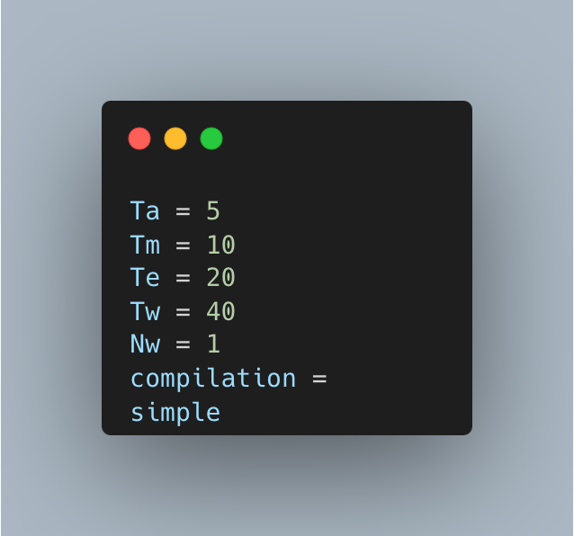

# Data-flow-project

## About project

The project realizes the simulation of data flow processing. Two input files **config.txt** and **test.txt** are loaded.
  
In the file **config.txt** there is the configuration of the project, which determines how the project will function:

  

In the file **test.txt** there are mathematical expressions that include basic operations, where each expression can have several operations, and it is separated in a separate line:

  

In addition to the two input files, a static library **lib** with an already designed data processing tool is provided. The goal of the project is to load the input files, use the attached static library and implement the compiler. The compiler needs to divide mathematical expressions into the smallest operations and execute them individually. Some operations in parallel, some not, and as a final result, it should return a test.mem file that contains in each row, sorted by the time of the start of execution, the operation that was executed and their duration in ns.

## Main parts of the project

### Read configuration

### Infix to Postfix

  

### Creation of imf file

  
  
  

test.txt        ->        test.imf

### Start Scheduler

### Make mem file
