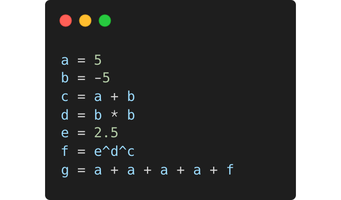
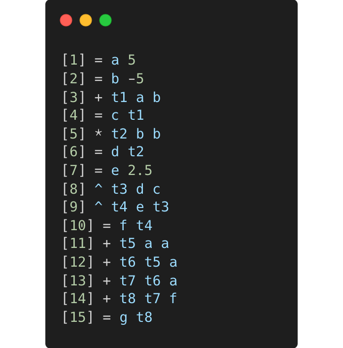

# Data-flow-project

## About project

## How it works

### Read configuration

### Infix to Postfix

  

### Creation of imf file

  
  :arrow_right:
  

test.txt        ->        test.imf

### Start Scheduler

### Make mem file
---
