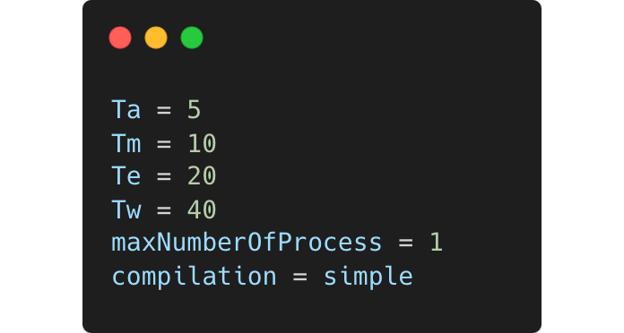

# Data-flow-project

## About project

The project realizes the simulation of data flow processing. Two input files **config.txt** and **test.txt** are loaded.
  
In the file **config.txt** there is the configuration of the project, which determines how the project will function:

  

In the file **test.txt** there are mathematical expressions that include basic operations, where each expression can have several operations, and it is separated in a separate line:

  

In addition to the two input files, a static library **lib** with an already designed data processing tool is provided. The goal of the project is to load the input files, use the attached static library and implement the compiler. The compiler needs to divide mathematical expressions into the smallest operations and execute them individually. Some operations in parallel, some not, and as a final result, it should return a test.mem file that contains in each row, sorted by the time of the start of execution, the operation that was executed and their duration in ns.

## Main parts of the project

### Read configuration

First you need to load the configuration with a function `readConfiguration(string configurationFileName, string fileName)`. There are several things in the configuration. At the beginning of the file are the times required to perform each of the mathematical operations. After that, there is a number that tells us how many operations can be performed in parallel. At the end, there is a compilation that talks about the strategy we use, and it can be **Simple** or **Advance**.
The strategy should divide each expression into simple mathematical operations that will be passed to the static library for processing. The Advance strategy, in contrast to the Simple strategy, sorts the operations so that the simplest ones are executed first and those that will take the least amount of time to execute. The operation can be performed only when the values of its operands have been calculated.
  
The **Configuration** class is responsible for this part.

---

### Creation of imf file

The **test.imf** file is created by the Compiler. The main function that is responsible for this is `compile(string fileName)`. It works so that the Compiler reads the test.txt file, converts the expressions into postfix form, divides each such expression into the smallest mathematical expressions made up of only one operation, and finally attaches it in a certain format.

#### Infix to Postfix

The program can hardly distinguish and resolve parentheses and mathematical operations in infix notation. Mathematical operations as well as parentheses have their own priority, which determines the order in which the operations will be performed. It is necessary to create a form that the computer can understand and that will work even without brackets. It is a postfix form. In the program, this was realized with the help of `infixToPostfix(line)`. An example of switching expressions from infix notation to postfix is given in the following image:

  

The **Compiler** and **Strategy** classes are responsible for this part. After converting the expression into postfix notation, it is necessary to single out each command that makes up that expression, and this will represent one line of the test.imf file. When it is finished, it is possible to see the transformation of the **test.txt** file into a **test.imf** file:

  
  
  

---

### Start Scheduler

The classes used in this part are **Machine**, **Operation** and two classes from the static library lib: **Scheduler** and **Event**. After creating the imf file, it is necessary to load that imf file and create operations that are found individually in each line of the imf file. This is done using the `readImf(string fileName)` function from the Machine class.  

When this is done, the operations are arranged into a waiting vector and an execution vector and sent to the **Scheduler** - a class from the static library that processes the passed operations, using the function `processNow()`. Before the operation is sent to the Scheduler class for execution, an Event for that operation is first created using the **Event** class from the static library, using the function  `create(Operation o, Time t)`. The two main functions that organize this process and communicate with these two classes from the static library are the `execute(string fileName)` and `schedule()` functions from class Machine. The execute function starts when reading the imf file and ends when all operations are completed. The schedule function organizes the sending of operations for processing.   Operations that are not currently executing are placed in the **waitingOperations** vector, and operations that are currently executing are placed in the **executingOperations** vector. When the operation is executed, it is removed from the executingOperations vector and a place is freed for a new operation from the waitingOperations vector, and in order for the operation to be executed, it is necessary that the operands of that operation have been calculated. The sign that the Operation is finished is given by the Scheduler, which calls the `notify(ID id)` function that is implemented in the Operation class. At the end of the notify operation, a log is recorded in the test.log file and other operations are updated, because the current operation may have produced an operand that is used in another operation that is waiting to be executed.

---

### Make mem file

 When the whole process is finished, it is necessary to save the processing results in the **test.mem** file. With the help of the static library, the order in which the operations were performed is remembered, as well as the start and duration of each operation. This is realized with the help of the **Memory** class and the file is saved with the help of the function save(string fileName). During execution in previous section, all necessary data for the mem file is saved in the Scheduler.
